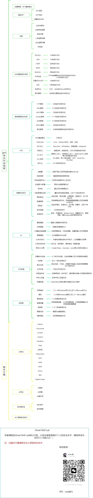

# APT单兵作战指南

许多人认为很难发起APT攻击，因为他们不知道APT攻击是如何发生的。事实上，随着自动化工具的发展，APT攻击很容易发起。

# Switch

[Switch to English](https://github.com/GhostWolfLab/APT-Individual-Combat-Guide/blob/main/README-en.md)

## 背景

该仓库是作者编写的《APT单兵作战指南》中的代码和命令仓库，用于帮助读者快速理解命令和代码的组成。

## 目录

第一章：[APT](Zh/第一章)

> 用于发起假旗攻击的代码和命令

第二章： [侦查](Zh/第二章)

> 用于信息收集的工具、代码和命令

第三章： [WEB漏洞进阶](Zh/第三章)

> 常见Web漏洞进阶技巧

第四章： [服务漏洞进阶](Zh/第四章)

> APT组织使用的服务漏洞以及在攻击中的常见技巧

第五章： [木马](Zh/第五章)

> APT组织编写的木马方式

第六章： [恶意软件技巧](Zh/第六章)

> APT攻击中使用的恶意软件技巧实现

第七章： [C2](Zh/第七章)

> 学习APT攻击者构建自己的C2

第八章： [木马投递](Zh/第八章)

> APT攻击中使用的木马投递技巧

第九章： [后渗透](Zh/第九章)

> APT攻击中所使用的后渗透方法

## 至此，V1版本更新完毕，在该版本中只同步了书籍代码，欢迎点击 Star

## 完整视频课程：

更强大可实战化的代码，更多漏洞进阶方式，更多方法！

### Ghost Wolf Lab 出版物：

